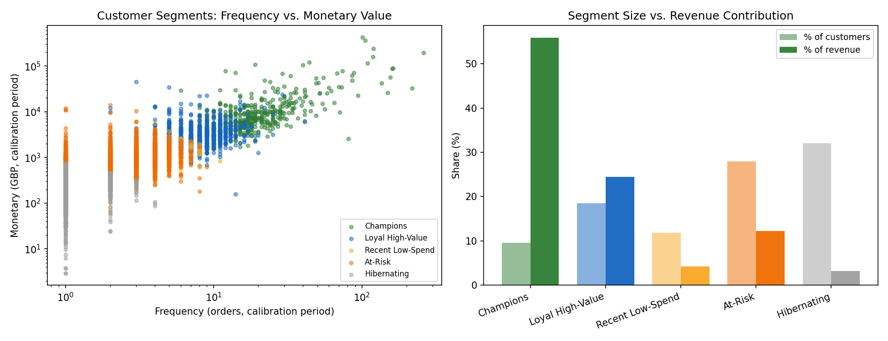
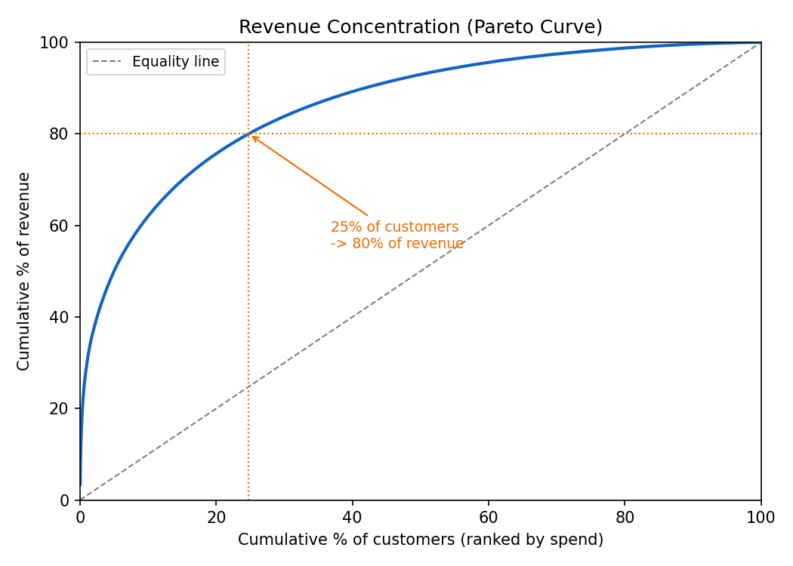
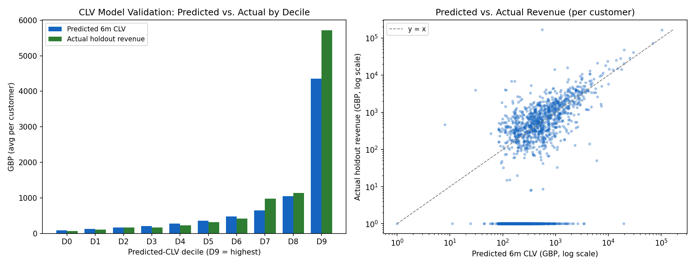
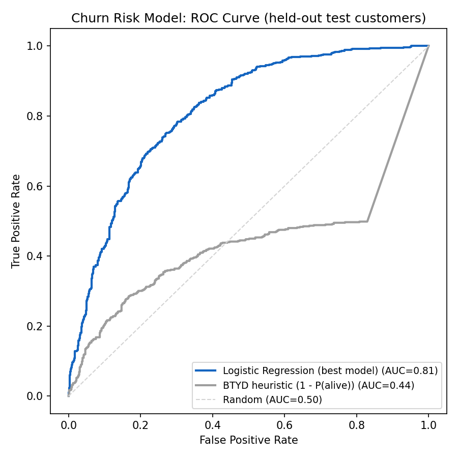
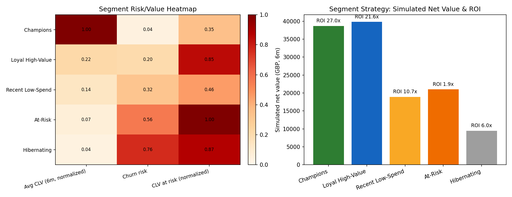

# RFM Segmentation, CLV Prediction & Churn Risk for Retail CRM

End-to-end customer analytics workflow on two years of UK e-commerce transactions: **RFM segmentation -> 6-month CLV prediction (BG/NBD + Gamma-Gamma) -> churn risk modeling -> segment-specific experiment design with cost-adjusted ROI simulation.**

The goal is not just to cluster customers — it's to answer the question a CRM/growth team actually has: *who is worth protecting, who is worth winning back, and is the campaign budget worth spending on them?*

## Live Demo

- Streamlit demo (bilingual English / 中文): https://josephwang-rfm-segmentation.streamlit.app/
- GitHub repository: https://github.com/josephwang-ds/rfm-customer-segmentation

## Portfolio Highlights

- Cleaned and analyzed **805,549 transactions** from the UCI **Online Retail II** dataset (Dec 2009 - Dec 2011, 5,878 customers, £17.7M revenue, 41 countries).
- Split customers into an 18-month calibration window and a 6-month holdout window, then validated every model against what customers *actually* did in the holdout — not just in-sample fit.
- Segmented 4,966 active customers into **5 RFM segments** via K-means; the top segment (Champions, 9.6% of customers) drives **55.8% of revenue**, and 25% of customers drive 80% of revenue.
- Built a **BG/NBD + Gamma-Gamma CLV model** (the `lifetimes` package) that predicts 6-month customer value with **0.84 correlation** to actual holdout revenue and correctly rank-orders customers from lowest to highest value across all 10 deciles.
- Built a **churn risk classifier** (logistic regression, AUC **0.81**) that beats a classic BTYD "probability alive" heuristic (AUC 0.44 — worse than random) because the heuristic can't distinguish a one-time buyer who'll return from one who won't.
- Combined segment + CLV + churn risk into a **segment strategy with a cost-adjusted ROI simulation**: £17.7K in campaign spend mapped to a simulated £127.8K net value (7.2x blended ROI), with explicit A/B test sample-size requirements per segment.

## Tech Stack

| Area | Tools |
|------|-------|
| Data analysis | Python, Pandas, NumPy, PyArrow |
| CLV modeling | `lifetimes` (BG/NBD, Gamma-Gamma) |
| Segmentation | Scikit-learn (K-means, StandardScaler) |
| Churn modeling | Scikit-learn (Logistic Regression, Random Forest, Gradient Boosting) |
| Experiment design | Statsmodels (power analysis) |
| Visualization | Matplotlib, Seaborn |
| App | Streamlit |

## Business Problem

A retailer wants to run targeted CRM campaigns instead of one-size-fits-all email blasts, but three questions block that:

1. **Who are our customers, behaviorally?** Not every customer should get the same treatment.
2. **What is each customer worth going forward?** A discount aimed at a customer worth £20 over the next 6 months is a different decision than one aimed at a customer worth £4,000.
3. **Who is about to churn, and is it worth trying to stop them?** Spending a £8 win-back voucher only makes sense if the expected recovered value exceeds the cost.

This project builds the full decision chain — segment -> predicted value -> churn risk -> targeted intervention -> ROI — using only transaction history, which is what most retailers actually have.

## Dataset

- **Source:** [UCI Online Retail II](https://archive.ics.uci.edu/dataset/502/online+retail+ii) — UK-based online gift retailer
- **Raw size:** 1,067,371 line items across two workbook sheets (Dec 2009 - Dec 2011)
- **Cleaning rules:** drop rows with missing `CustomerID`, `Quantity <= 0`, `Price <= 0`, or cancelled invoices (`Invoice` starting with `C`)
- **After cleaning:** 805,549 transaction rows, 5,878 customers, 36,969 invoices, **£17.74M** revenue, 41 countries (UK = 90% of rows)

Place `online_retail_ii.xlsx` (or a combined parquet built from both sheets) under `data/raw/` — see `src/data_prep.py`.

## Calibration / Holdout Design

Every model in this project is validated the same way:

- **Calibration period:** 2009-12-01 -> 2011-06-09 (~18 months) — used to compute RFM features and train models
- **Holdout period:** 2011-06-09 -> 2011-12-10 (~6 months) — used only to check whether predictions came true

This mirrors how a real CRM team would operate: segment and score customers today, then see whether those scores predicted what customers actually did over the following two quarters.

## Project Architecture

```text
rfm-customer-segmentation/
├── app/
│   └── streamlit_app.py        # Interactive portfolio demo
├── data/
│   ├── raw/                    # Online Retail II source files, not committed
│   └── processed/               # Feature tables & predictions, CSVs committed
├── reports/
│   ├── figures/                # Committed analysis figures (fig1-fig5)
│   ├── segment_summary.csv      # Segment-level KPIs
│   └── experiment_design.md     # A/B test plans + ROI simulation
├── src/
│   ├── data_prep.py             # Load + clean Online Retail II
│   ├── rfm_segments.py          # RFM features + K-means segmentation
│   ├── clv_model.py              # BG/NBD + Gamma-Gamma CLV prediction
│   ├── churn_model.py            # Churn risk classifier + BTYD baseline
│   ├── segment_strategy.py       # Experiment design + ROI simulation
│   └── make_figures.py           # Generates reports/figures/*.png
├── README.md
└── requirements.txt
```

## Methodology

### 1. RFM Segmentation (`src/rfm_segments.py`)

- Compute Recency / Frequency / Monetary from calibration-period transactions only.
- Apply `log1p` + `StandardScaler`, then K-means (k=5, chosen via silhouette score across k=2-7).
- Label clusters using business rules on recency/frequency/monetary medians, distinguishing **At-Risk** (lapsed customers who *used to* buy repeatedly) from **Hibernating** (one-time buyers who never returned) — a distinction that turns out to matter a lot for churn modeling (see below).

### 2. CLV Prediction (`src/clv_model.py`)

- Fit **BG/NBD** on calibration-period frequency/recency/tenure to model purchase timing.
- Fit **Gamma-Gamma** on repeat buyers to model average order value (frequency/monetary correlation = 0.13, low enough for the independence assumption).
- Predict each customer's expected purchases and CLV over the 6-month holdout, then validate against actual holdout revenue.

### 3. Churn Risk Model (`src/churn_model.py`)

- Label: did the customer make **zero purchases** in the holdout window? (48% churn rate)
- Features: recency, frequency, monetary, tenure, average order value, recency ratio, plus the BG/NBD-predicted purchases and CLV (all calibration-period only — no leakage).
- Compare Logistic Regression, Random Forest, and Gradient Boosting against a **BTYD heuristic baseline** (`1 - P(alive)` from BG/NBD).

### 4. Segment Strategy & ROI Simulation (`src/segment_strategy.py`)

- For each segment, compute **CLV at risk** = avg predicted CLV x churn probability.
- Define a targeted intervention with an explicit cost and an assumed retention-rate uplift (the assumption to be tested).
- Run a power analysis (alpha=0.05, power=0.80) to get the required A/B test sample size per segment, and flag which segments are large enough to test as designed.
- Simulate net value and ROI of a full-segment rollout if the assumed uplift holds.

## Key Results

### Segments: a 9.6% / 55.8% revenue concentration



| Segment | Customers | % of revenue | Median recency (days) | Median frequency | Median monetary |
|---|---:|---:|---:|---:|---:|
| Champions | 477 | 55.8% | 15 | 17 | £6,847 |
| Loyal High-Value | 920 | 24.5% | 66 | 7 | £2,547 |
| At-Risk | 1,390 | 12.3% | 207 | 3 | £864 |
| Recent Low-Spend | 589 | 4.2% | 18 | 3 | £717 |
| Hibernating | 1,590 | 32.0% (of customers) / 3.2% (of revenue) | 255 | 1 | £233 |

25% of customers generate 80% of revenue:



### CLV model: rank-orders customers correctly, slightly conservative on totals



- Predicted-vs-actual purchase count correlation: **0.85** (MAE 1.05 orders)
- Predicted-vs-actual 6-month revenue correlation: **0.84**
- Portfolio total: predicted £3.86M vs. actual £4.63M holdout revenue (**-16.6%**, a typical conservative bias for BG/NBD on a dataset with strong post-holiday seasonality)
- Decile check confirms the model separates low-value from high-value customers cleanly — the highest-CLV decile (D9) captures customers who go on to generate ~£5,700 in actual 6-month revenue, vs. ~£66 for the lowest decile

### Churn model: ML beats the textbook BTYD heuristic — and the *reason why* is the interesting part



- Logistic regression: **AUC 0.81**
- BTYD heuristic (`1 - P(alive)`): **AUC 0.44** — worse than a coin flip
- **Why:** BG/NBD assigns `P(alive) = 1.0` to every customer with zero repeat purchases in the calibration period, because the model has no evidence of "dropout" for someone who's only bought once. But empirically, **one-time buyers churn at 73.9%** vs. **36.2% for repeat buyers** — exactly the opposite of what the heuristic implies. The ML model picks this up because it uses recency, tenure, and predicted CLV directly rather than relying on the BTYD "alive" framing.
- Top features by importance: predicted purchases (6m), predicted CLV, recency, and total monetary spend.

### Segment strategy: £17.7K spend -> £127.8K simulated net value (7.2x blended ROI)



| Segment | CLV at risk (6m) | Intervention | Cost | Simulated ROI |
|---|---:|---|---:|---:|
| Champions | £80,340 | VIP early access + loyalty perks | £1,431 | 27.0x |
| Loyal High-Value | £196,663 | Personalized cross-sell email | £1,840 | 21.6x |
| At-Risk | £232,030 | 15% win-back discount + email | £11,120 | 1.9x |
| Recent Low-Spend | £106,146 | 3-email onboarding series | £1,767 | 10.7x |
| Hibernating | £202,142 | Low-cost reactivation email | £1,590 | 6.0x |

At-Risk and Hibernating together hold **53% of total CLV at risk (£434K of £817K)** despite contributing only 15.5% of current revenue — these are the segments where intervention has the most leverage. At-Risk is also the **only segment large enough (1,390 customers) to run a properly powered A/B test** at the assumed effect size; see `reports/experiment_design.md` for the full per-segment test design, including which segments need a longer test window or pooled cohorts.

## Business Interpretation

The chain RFM -> CLV -> churn risk -> intervention -> ROI turns three separate analyses into one targeting decision. A segment with high revenue share (Champions) doesn't need a win-back budget — they're not at risk. A segment with low revenue share but high CLV-at-risk (Hibernating, At-Risk) is exactly where a marginal pound of CRM spend goes furthest, *if* the assumed uplift is real — which is why the experiment design (not just the simulation) is the actual deliverable.

## Limitations

- The -16.6% portfolio-level CLV underprediction is a known BG/NBD tendency on data with strong seasonality (this dataset includes two holiday peaks); a production deployment would calibrate this bias or add a seasonal adjustment.
- Retention-rate uplift assumptions (+2pp to +8pp) are illustrative; they should be replaced with effect sizes from prior campaigns or a pilot test.
- The Streamlit demo uses the pre-computed model outputs in `data/processed/` (CSV) rather than re-running the full `lifetimes` pipeline live, so the public app stays lightweight and reproducible without raw data.

## Reproduction

```bash
python -m venv .venv
source .venv/bin/activate
pip install -r requirements.txt

# 1. Place online_retail_ii.xlsx (or a combined parquet) under data/raw/
python src/data_prep.py

# 2. RFM segmentation + calibration/holdout split
python src/rfm_segments.py

# 3. CLV prediction (BG/NBD + Gamma-Gamma)
python src/clv_model.py

# 4. Churn risk model
python src/churn_model.py

# 5. Segment strategy + ROI simulation
python src/segment_strategy.py

# 6. Regenerate figures
python src/make_figures.py

# 7. Run the demo app
streamlit run app/streamlit_app.py
```

## Future Work

- Replace the K-means segmentation with a probabilistic/soft-clustering approach so customers near segment boundaries get blended treatment.
- Add a seasonal adjustment to the BG/NBD calibration to close the -16.6% portfolio gap.
- Connect the experiment design to real campaign data once a pilot is run, replacing assumed uplifts with measured ones.
- Extend the churn model with product-category features (what they bought, not just how often).

## License

For portfolio and educational use. UCI Online Retail II is available for research/educational use — verify licensing before commercial deployment.
